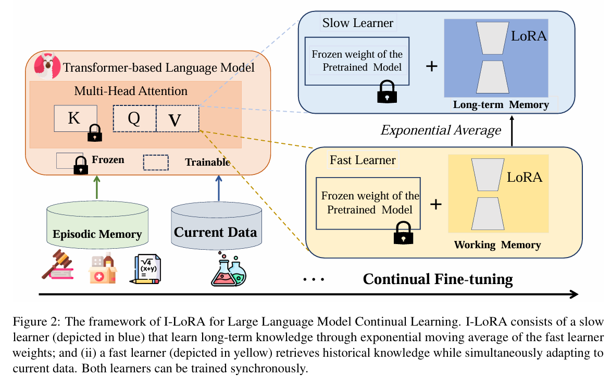

# Analyzing and Reducing Catastrophic Forgetting in Parameter Efficient
Tuning

# Introduction

這篇文章旨在解決大型語言模型（LLMs）在持續微調複雜且多樣化的專業領域任務時，所面臨的**災難性遺忘（Catastrophic Forgetting）**問題。災難性遺忘指的是模型在學習新任務時，無法保留過去任務的推理能力，因此需要在**學習靈活性（plasticity）**和**記憶穩定性（stability）**之間取得平衡。

現有的常見三種策略:

- **記憶回放（Memory Replay）**：保存部分歷史數據，以減少遺忘。
- **正則化方法（Regularization）**：透過約束關鍵模型參數的變化來保留舊知識。
- **參數隔離（Parameter Isolation）**：專門為不同任務分配獨立的模型參數，以降低任務之間的干擾。

這篇研究引入**模式連接（Mode Connectivity）**的概念，闡釋了不同任務的最優解可藉由損失地形中的連通路徑相連，以降低遺忘。研究發現，在 LLMs 的持續學習中，模式連接現象廣泛存在，並能有效調和學習的適應性與記憶的穩固性。

基於這一發現，研究者提出了一種**簡單但有效**的方法——**插值式LoRA（Interpolation-based LoRA, I-LoRA）**，其核心理念是透過LoRA參數插值構建一個**雙記憶經驗回放框架**：

- **快學習者（Fast Learner）**：負責快速適應新數據，類似於短期記憶。
- **慢學習者（Slow Learner）**：負責保留長期記憶，以防止過去學習的知識被遺忘。

透過在**八個專業領域的基準測試（Continual Learning Benchmarks）**進行大量實驗，研究顯示**I-LoRA比現有最先進的方法提升了最多11%的性能**，提供了一個可靠的基準。

# 方法

## Dual Memory for Fast and Slow Learning

### 雙記憶框架

I-LoRA的核心是雙記憶框架，模擬人類大腦的短期記憶（快速適應）和長期記憶（穩定儲存），具體包括：

- **快速學習者（Fast Learner）**：
    - **參數化**：由工作記憶 $\theta^w$ 表示。
    - **功能**：負責快速適應當前任務（任務t），模擬短期記憶的快速更新能力。
    - **更新方式**：通過反向傳播梯度優化，基於混合數據（當前任務數據 $\mathcal{D}_w$與記憶緩衝區  $\mathcal{M}$）學習。
- **慢速學習者（Slow Learner）**：
    - **參數化**：由長期記憶 $\theta^l$表示。
    - **功能**：整合歷史任務知識，模擬長期記憶的穩定性，防止災難性遺忘。
    - **更新方式**：使用指數移動平均（Exponential Moving Average, EMA）沿低損失路徑插值，基於快速學習者 $\theta^w$的權重更新。

### 訓練流程

**參數插值機制：**

- 慢速學習者的更新公式:
    
    $$
    \theta^l_k=\lambda\cdot\theta^l_{k-1}+(1-\lambda)\cdot\theta^w_k
    $$
    
    其中λ為固定步長因子（通常小於1），k為訓練步驟。這個公式模擬沿線性模式連通性路徑的平滑過渡。
    

**快速學習者的優化 :**

- 損失函數結合兩部分:
    
    $$
    \mathcal{L} = \mathcal{L}_{CE} + \gamma \cdot \mathcal{L}_{MSE}
    $$
    
    - $\mathcal{L}_{CE}$: 交叉熵損失，針對當前任務 $\mathcal{D}_t$ 和記憶緩衝區 $\mathcal{M}$ 的預測錯誤。
    - $\mathcal{L}_{MSE}$: 均方誤差損失，衡量 $\theta^w$ 的輸出與 $\theta^l$ 的歷史嵌入表示的偏差，$\gamma$為權重超參數。
- 更新公式:

$$
\theta_k^w \leftarrow \theta_{k-1}^w - \eta \nabla_{\theta_{k-1}^w} \mathcal{L}
$$

其中 $\eta$ 為學習率。