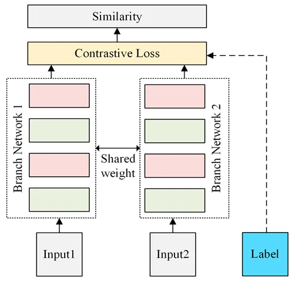
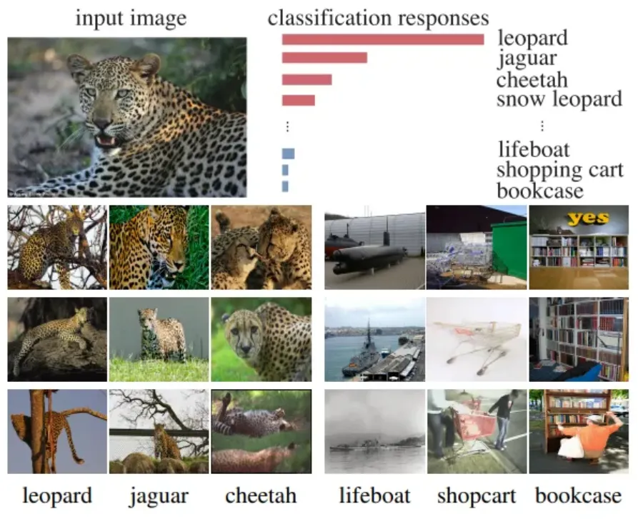
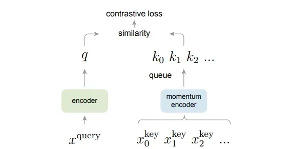
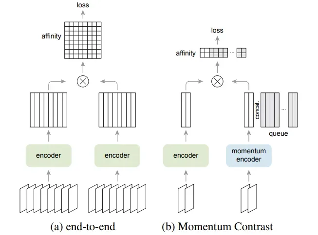
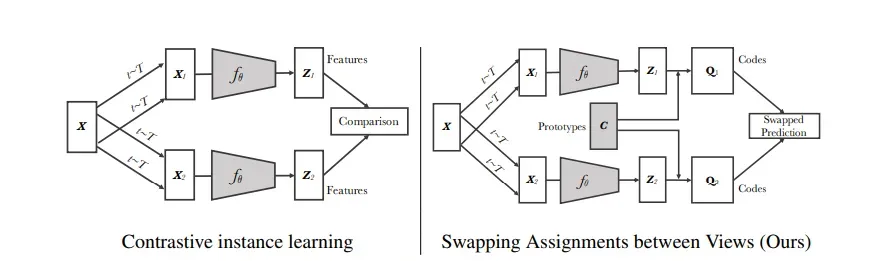
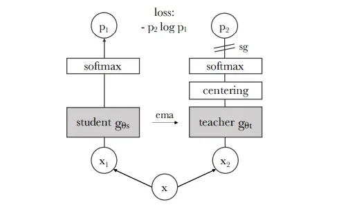
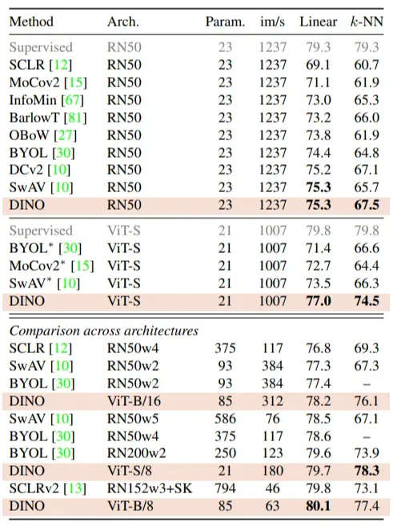

# 對比學習

# 簡介

Contrastive Learning 目前在 Self-Supervised Learning 中最為廣泛運用，其概念為相同類別的圖像間的相似度越高越好 (即距離盡可能地近)，不同類別的圖像相似度越低越好 (即距離盡可能地遠)，模型架構主要是使用 Siamese Network（孿生神經網路）。

1. **輸入（Input1, Input2）**
    - 這兩個輸入可以是兩張圖片、兩段文字或其他需要比較的資料。
2. **孿生網路（Branch Network 1 & 2）**
    - 這兩個網路是完全相同的（共享權重），它們會將輸入轉換成特徵向量（Feature Representation）。
3. **對比損失（Contrastive Loss）**
    - 使用對比損失函數來計算兩個特徵向量的相似度，該函數的目標是讓相似的樣本靠近，不相似的樣本遠離。
4. **相似度計算（Similarity）**
    - 根據輸出特徵向量計算相似度，若相似則代表這兩個輸入屬於相同類別，否則屬於不同類別。
5. **標籤（Label）**
    - 真實標籤指示這兩個輸入是否相同（1 表示相同，0 表示不同），用來監督模型訓練。

## 對比學習的Loss function

[Understanding Contrastive Representation Learning through Alignment and Uniformity on the Hypersphere ( ICML2020 )](https://arxiv.org/pdf/2005.10242)

對比學習通常使用 InfoNCE 作為損失函數來訓練模型，可以說理解了 InfoNCE 就基本上能夠很好地掌握自監督的核心思想。

### 透過公式理解InfoNCE

公式中，最上面一行是InfoNCE的一般表示，給定 $(x, y)$ 是一對positive pair，同時有很多負樣本 ${y^-}$和 $x$ 構成 $(x, y^-)$ negative pair。

<aside>
💡

這裡需要一個數學前置知識：

- 向量 a 與向量 b 同向，$a⋅b=∣a∣∣b∣$
- 向量 a 與向量 b 垂直， $a⋅b=0$
- 向量 a 與向量 b 反向， $a⋅b=−∣a∣∣b∣$

所以當 positive pair 的方向儘可能相似，negative pair 的方向儘可能不相似時，InfoNCE 的值趨近於 0。

</aside>

### 透過單位超球面理解InfoNCE

上圖公式可以看到InfoNCE被推導成兩個部分，alignment and uniformity。

如上圖所示，alignment 部分只與 positive pair 相關，希望 positive pair 的特徵拉近；uniformity 部分只與 negative pair 相關，希望所有點的特徵儘可能均勻分佈在 unit hypersphere 上。

使不同的特徵儘可能均勻地分佈在單位超球體上帶來的一個好處是，非常容易對不同類別進行聚類並且線性可分。

<aside>
💡

自監督學習通常會學習到更平滑且結構化的特徵空間，使得相似的輸入在特徵空間中會被映射到鄰近的位置。這種特性對於生成式模型（如 VAE、GAN、Diffusion Models）來說特別有幫助，因為它們需要在潛在空間（Latent Space）進行連續的插值或操控，以確保生成的樣本具有平滑的過渡和合理的變化。

</aside>

作者在 CIFAR-10 上分別對隨機初始化（Random Initialization）、有監督預測學習（Supervised Predictive Learning）和無監督對比學習（Unsupervised Contrastive Learning）三種模型進行實驗，觀察到了上述單位超球體（unit hypersphere）的實驗結論：

- **隨機初始化（Random Initialization）：**
    - 沒有將不同類別的特徵均勻分開，導致對齊（alignment）的平均距離很小，但是判別力很差。這意味著特徵分佈混亂，模型無法有效區分不同類別。
- **有監督預測學習（Supervised Predictive Learning）：**
    - 由於監督信號的引導，不同類別的特徵既散開又集中。
    - 又因為引入了標註偏見，導致對齊（alignment）的平均距離介於隨機初始化和無監督對比學習之間。
    - 標籤數據中存在的偏差或不準確性。例如，標籤可能不完全正確，或者某些類別的樣本數量過少（類別不平衡）。
    - 監督信號引導模型學習區分不同類別，但標註偏見可能限制了特徵的泛化能力。
    - 監督學習沒有要求特徵空間分布
- **無監督對比學習（Unsupervised Contrastive Learning）：**
    - 特徵非常均勻連續地散開，對齊（alignment）的平均距離是最小的。
    - 這說明無監督對比學習確實能夠得到非常強判別力的特徵。
    - 無監督學習，盡可能的讓特徵在超球體上均勻的分佈，讓特徵之間相互的排斥，所以對齊的平均距離最小。
    - 無監督對比學習通過對比正負樣本，學習到更具判別性的特徵表示。

# InvaSpread ( CVPR 2019 )

[Unsupervised Embedding Learning via Invariant and Spreading Instance Feature](https://arxiv.org/pdf/1904.03436)

InvaSpread 沒有使用數據結構 Memory Bank 去存儲負樣本，InvaSpread 只用一個 Encoder 進行端到端的學習，可以在同一個 mini batch 中實現正負樣本的對比學習。InvaSpread 可以被理解成是 SimCLR 的前身。

圖 4 展示 InvaSpread 的基本思路。InvaSpread 認為同一圖片在不同數據增強下的特徵應該是不變的，而不同圖片在數據增強後特徵應該是分開的。這也對應著題目的 invariant 和 spread，即相似圖片特徵保持不變性，不相似的圖片特徵分佈發散。

圖 6 展示 InvaSpread 的模型架構圖。 InvaSpread 設計了一個孿生網絡，把原始圖片放入一個 CNN Encoder，把增強後的圖片放入另一個 CNN Encoder。這兩個 CNN Encoder之間是參數共享的。接著進行降維、 L2-Norm。訓練完成後，某一張圖片及其對應的數據增強圖片學到的特徵應該是相似的，它們在 Embedding Space 中的分佈也應該是接近的。

# InstDisc ( NIPS 2020 )

[Unsupervised Feature Learning via Non-Parametric Instance Discrimination](https://arxiv.org/pdf/2006.09882)

InstDisc 首次提出個體判別(Individual Instances)的代理任務(Pretext Task)，以及數據結構 Memory Bank 來儲存負樣本。

個體 : 機器需要學習到，每一張圖片都是獨一無二的，即使它們看起來非常相似。

代理任務 : 容易讓機器學習的「假任務」，透過解決這個假任務，機器能夠學習到有用的特徵表示。來取代以往需要label才能讓model學特徵的方式。

作者認為與豹相似度高的圖片會聚集在一起的原因，並不是因為他們有相似的語意標籤(Label)，是因為豹跟這些圖片長得太像了。而跟救生艇(lifeboat)、購物車(shopcart)、書櫃(bookcase)長得就是很不像。

圖 2 展示 InstDisc 的模型架構圖。InstDisc 使用一個 CNN Encoder 訓練對比學習網路，正樣本是圖片本身和其圖片的數據增強，負樣本是數據集中其餘的圖片。InstDisc 使用一個數據結構 Memroy Bank 來儲存負樣本，把所有圖片的特徵都存在數據結構 Memory Bank 這個字典裡。

作者希望這些編碼後的特徵，在特徵空間裡能夠盡可能地分開，因為對於個體判別任務來說，每張圖片都是自己的類別。

# MoCo v1 ( CVPR 2020 )

[Momentum Contrast for Unsupervised Visual Representation Learning](https://arxiv.org/pdf/1911.05722)

MoCo v1 基於 instDisc 的架構下進行了一系列的改進，MoCo v1 提出隊列 queue 儲存取代了 InvaSpread 的數據結構 Memory Bank 儲存，並改為動量編碼器。

基本概念是將無監督學習視為一個字典查詢任務。

### **基本概念是將無監督學習視為一個字典查詢任務**

簡單來說就是要解決小batch下負樣本不夠多的問題，使用額外的資料結構來儲存負樣本特徵，負樣本夠多才能在空間中達到均勻性(不同的類別分得越開)。

**鍵 (Keys)** : 每一張圖像經過編碼器後得到的向量表示都被視為字典中的一個「鍵」，這個鍵包含了圖像的特徵信息。

**查詢 (Query)** : 當模型接收到一張新的圖像（或者同一張圖像的另一種增強視圖）時，它會生成一個「查詢」向量。

**查找匹配的鍵** : 模型的目標是，對於一個給定的查詢，在字典中找到與之最相似的鍵 . 如果查詢和某個鍵來自同一張原始圖像的不同增強，那麼它們在理想的表示空間中應該非常相似，反之則應該有很大的差異。

### 動量編碼器

上圖是動量更新規則，m是動量係數，通常設置為接近1的值(例如0.999)，來盡量保留key encoder的權重。

如果沒有動量機制，則等於是直接把查詢編碼器的權重複製到鍵編碼器，導致鍵的表示變動快速，所以需要動量機制來平滑權重更新過程，來維持字典的一致性。

# SimCLR v1 ( ICML 2020 )

[A Simple Framework for Contrastive Learning of Visual Representations](https://arxiv.org/pdf/2002.05709)

SimCLR v1 基於 InvaSpread 的架構下進行了一系列的改進 :

- SimCLR v1 使用了更多的數據增強。
- 加入了 Projector 層，就是一個 MLP 層，在得到數據的編碼之後在加一個編碼層 g(⋅) 函數，想讓模型訓練的更好。
- simCLR v1 用了更大的 Batchsize、更多的 Epochs。

通過一個編碼器 f(⋅) 對正負樣本進行編碼得到結果 hi 和 hj。接著再通過一個編碼器 g(⋅)，得到較低維度的特徵 zi 和 zj，用其進行對比學習，拉近正例之間的距離，推遠負例之間的距離。

對多種資料擴增方法實驗後，**使用color distortion + random crop效果最好**。

在ImageNet比MoCo v1好10%，但依賴大Batch size ( 硬體需求大 ) 。

# MoCo v2 ( 2020 )

[Improved Baselines with Momentum Contrastive Learning](https://arxiv.org/pdf/2003.04297)

MOCO v2 把 SimCLRv1 值得借鑒的地方都拿來了，於是 MoCo v2 兩頁的實驗報告就的誕生了。

上圖展示 SimCLR 的 end-to-end 和 MOCO 的 Momentum Contrast。SimCLR v1 使用的方法就是 MoCo v2 中提到的 end-to-end 的方法，其就是存在 GPU 容量大小限制的問題。

Table 1展示在MoCo v1加上SimCLR的改進點的效果 :

- 加入了 MLP 層( 也就是 SimCLR v1 提出的 Projector 層)。
- 加入更多的數據增強方式。
- 訓練的時候改用 cosine 的 learning rate schedule。
- 訓練更長的 epochs，從 200 變到了 800。

MoCov2相比SimCLR，在batch size更小的情况下，能夠達到更好的效果。

# SimCLR v2 ( NIPS 2020 )

[Big Self-Supervised Models are Strong Semi-Supervised Learners](https://arxiv.org/pdf/2006.10029)

SimCLR v2 花了很大的篇幅介紹如何使用非常大的 Unsupervised Learning 模型來幫助 Self-Supervised Learning 取得更好的效果，基本上就是知識蒸餾。

SimCLR v2 基於 SimCLR v1 的架構下進行了一系列的改進 :

- SimCLR v 使用了 ResNet-152 作為它的 backbone，同時用了 Selective Kernels Networks(SK-Net)
- SimCLR v2 測試 2 個、3 個 Projector 層的效果，最後發現用 2 個的效果最好（1 個 Projector = fc + relu，2 個 Projector = fc + relu + fc + relu）
- SimCLR v2 嘗試使用 MOCO 的動量編碼器，發現效果提升的 1 %，提升的沒有很顯著，可能原因為 SimCLR v2 已經有很大的 Batchsize 了，所以不需要動量編碼器以及隊列的負樣本了。

Selective Kernel Networks (SK-Net)：卷積通常 kernel size 是固定的，而 SK-Net 的主要改進就是讓模型使用數種 kernel size 進行卷積並且能學習到如何選擇 kernel size（所以才叫 selective kernel）。

**SimCLR的發展就到 v2 ，這種方法需要很大的Batch size，沒有很大的VRAM無法實做。**

# **SwAV ( NIPS 2020 )**

[Unsupervised Learning of Visual Features by Contrasting Cluster Assignments](https://arxiv.org/pdf/2006.09882)

此篇的背景是一位做聚類的研究者提出以往做對比學習時選擇負樣本的三大問題 :

1. **會重複的抽取到同一數據**，極端的情況下，如果抽到一組圖片作為正樣本，有可能右抽到同樣重複的一組圖片作為負樣本。
2. **不具有整個數據集的代表性**，比如這個數據其實有很多種動物，但是抽到的都是同一種動物，這樣數據就是沒有代表性的。
3. **選取的越全面當然效果越好，但如果選取的過多的負樣本又會造成計算資源的浪費**（通常只有當負樣本較多時效果才會好），導致對顯示卡內存和計算量的要求非常高。

在 Contrastive Learning 的基礎上結合 clustering，不直接比較 representation，而是比較不同視角 (View) 下的聚類結果 (clustering assignments)，並且該結果可以互相交換預測 (Swapping)。

兩者的差異如圖，在 SwAV 的作法中會將 representation $z_i$ 與 Prototypes C 做內積後再進行 softmax，計算出相似程度得到 Codes Q，接著交叉預測不同 View 的 Codes，其中 Prototypes 為 clustering 中心。

聚類中心 $C = \{c_1, c_2, ..., c_k\}$ 是可學習的參數，通常會隨機初始化。

loss function 定義為交叉預測結果之和

此外，提出了新的 data augmentation 方法 — Multi-crop，由 2 個較大的 crops 和 V 個較小的 crops 所組成 (ex: 2 個 160 resolution+4 個 96 resolution)，能夠學習更局部的特徵、提升正樣本的數量，也不會增加計算量。由下圖的實驗結果可得知採用 Multi-crop 能增加 4% 的準確率，而且不只在 SwAV 有效，對於其他的 SSL 方法也有很大的幫助。

**簡單來說就是在圖片輸入後先找到圖片應該屬於哪個可學習的聚類中心（prototypes），再去把圖片特徵分配到空間內。**均勻性由**Sinkhorn-Knopp算法：強制均勻分配**處理，對齊則是使用對比學習。

能解決**需要大量負樣本來做到空間均勻性，**SwAV通過**聚類分配**和**交換預測目標**來避免顯式的負樣本對比，從而大幅減少計算資源的需求。

# BYOL ( 2020 )

[Bootstrap your own latent: A new approach to self-supervised Learning](https://arxiv.org/pdf/2006.07733)

論文名稱 : 自舉潛在表示，點出論文提出的方法是一種自舉過程，與傳統對比學習依賴負樣本不同。

整體思路就是將上半部的網絡拿來預測下半部網絡的內容，讓二者盡量相似。

$v$ 與 $v'$是兩個同樣圖片的數據擴增版本，強迫模型學習到關鍵特徵來分為同樣類別。

L2 loss代表是要預測到target部分的projection輸出

架構上圖片encoder與projector都有採用動量更新機制。

**BYOL因為僅考慮正樣本對，非常容易出現退化解，**論文也承認了存在一個明顯的 undesirable equilibria會導致 collapsing**。針對退化解的問題，因為非常的不直覺，論文也沒有說明均勻性部分是如何做到，只有做如何避免表示崩潰的說明 :**

- 線上網絡與目標網絡：
    - 這種設計有助於保持表示的多樣性，因為目標網絡作為穩定的參考點，線上網絡必須不斷適應並學習新的信息。
    - 線上網絡是「當前自己」，目標網絡是「過去的自己」的平均。為了超越過去的自己，當前自己必須不斷進步（編碼更多信息），從而保持多樣性。
- 預測器的關鍵作用：
    - 預測器是防止崩潰的關鍵組件，位於線上網絡的投影層之上，負責預測目標網絡的投影。如果移除預測器，模型會崩潰，這在消融研究中得到證實。
    - 這額外的層次迫使線上網絡學習更豐富的表示幫助預測目標網路輸出，而非簡單複製目標網路的輸出。
- 非對稱架構設計 :
    - 防止線上網絡與目標網絡同步收斂到崩潰解，增加訓練動態的複雜性與多樣性。

上圖的右邊Beta代表使用SimCLR的InfoNCE損失函數，SimCLR與BYOL差別在有無預測器、目標網路、損失函數。

第3.2節中，作者試圖解釋BYOL為何能夠避免表示崩潰。他們指出，儘管從理論上看，BYOL的損失函數和更新動態允許一些不理想的均衡點存在，但實際實驗中並未觀察到這種情況。

# SimSiam ( CVPR 2021 )

[Exploring Simple Siamese Representation Learning](https://arxiv.org/pdf/2011.10566)

SimSiam簡單用一句話描述就是**沒有momentum encoder的BYOL**。BYOL拿掉了MoCo的memory bank，SimSiam進一步地拿掉了momentum encoder。方法簡單，實務上同樣能避免collapsing output的發生。

SimSiam的架構與BYOL一樣是三個階段的架構，先過主網路embedding，再過小網路projection，最後過小網路prediction。與BYOL不同之處在於SimSiam並沒有兩組網路參數，**同一個網路對於不同的view交互地用latent projection互為彼此的prediction target**。在更新參數時，都只計算prediction那條路線的gradient，也自然沒有什麼momentum encoder。

作者認為近期的unsupervised或self-supervised learning大多都使用了某種形式的siamese network，也就是對於成對或多個輸入使用共享參數的網路，藉以計算某種相似度。論文進一步的推斷，在這樣的**Siamese架構下存在兩個不同的最佳化任務，實現兩個observation的matching**。就像是convolution是modeling translation invariance的歸納偏置 (inductive bias)，**Siamese架構也是一種modeling invariance的inductive biases。這個invariance指的就是data augmentation invariance。**

論文透過實驗展示，不論是predict head的設計、batch的大小、batch normalization的使用、similarity function的設計、或是對比性的symmetrization都不是避免collapsing output的關鍵。並且透過額外的實驗旁敲側擊地佐證，**導入stop gradient的操作等同於引入一些虛構的參數，讓SimSiam類似於某種expectation maximization (EM)的演算法，去估算data augmentation的期望值。**

SimSiam 論文文件中， **PAGE7** 的 **5.3. Discussion** 小節中：

> "Our hypothesis is about what the optimization problem can be. It does not explain why collapsing is prevented. We point out that SimSiam and its variants' non-collapsing behavior still remains as an empirical observation."
> 

這段文字明確指出，SimSiam 及其變體的非崩潰行為（non-collapsing behavior）仍然只是一個經驗觀察（empirical observation），而論文提出的假設主要聚焦於優化問題的形式，並未完全解釋為什麼能夠避免崩潰。

<aside>
💡

**核心思想**：用預測器從一個視圖推測另一個視圖的表示，停止梯度防止退化解，從而學到對所有資料擴增可能有不變的表示。

**為什麼有效**：預測器模擬期望，停止梯度保持多樣性，簡單卻足以避免崩潰並學習有意義的特徵。

</aside>

在實驗結果上，SimSiam在小的epoch表現就可以不錯，但是長遠來看還是BYOL好。

實驗證明簡單的**停止梯度操作**配合**預測器**足以避免崩塌，架構最簡潔。

# MoCo v3 ( ICCV 2021 )

[An Empirical Study of Training Self-Supervised Vision Transformers](https://arxiv.org/pdf/2104.02057)

MOCO v3 全篇 Focus 在如何訓練 Vision Transformer 的 Self-Supervised Learning，談討最初調整超參數(Batch Size、Learning Rate、optimizer)。

# DINO ( 2021 )

[Emerging Properties in Self-Supervised Vision Transformers](https://arxiv.org/pdf/2104.14294)

DINO的架構類似BYOL，差別在 : 不使用預測頭且教師網路採用了centering與sharpening的機制來做到均勻性。

訓練時學生網路會使用經過crop的局部視圖與全局視圖，教師網路只會有全局視圖，強迫模型去關注多尺度來學習關鍵特徵。消融實驗中證明增加局部試圖對於KNN準確度有顯著提升。

<aside>
💡

多尺度會要求模型在這些不同尺度的視圖間保持一致性，可能導致特徵表示不僅依賴簡單的線性映射，而是需要捕捉更複雜的、非線性的模式。

- 這種狀況下對於非線性的分類器較有優勢
- 而KNN準確度高通常代表有著高品質的特徵空間
</aside>

Centering是計算全局移動平均，可以看出分布勢減去C可以把特徵分布拉回原點讓分布更稱。

中心化防止某個維度主導，但如果僅使用當下批次均值，可能導致均勻分佈的崩潰。

Sharpening確保教師模型的輸出分佈變得尖銳，從而提供更有意義的學習信號。 

中心化傾向於推向均勻分佈，而銳化則推向尖銳分佈，這兩者形成平衡，穩定訓練。

使用溫度參數來放大特徵值讓分布更加尖銳

表中可以看出DINO的表現優於以前的方法，尤其是在ViT架構，參數量也不大。

<aside>
💡

DINO模型特別要求多尺度一致性，CNN方式相較ViT較不靈活而且丟失細節資訊。

( 有可能CNN有提供資訊但DINO架構抓不到 )

</aside>

# 對比學習架構比較：負樣本依賴性與關鍵防崩塌機制

| 方法名稱 | 發表時間 | 依賴負樣本 | 停止梯度 | 預測器 | 動量編碼器 | 防崩塌機制 | 損失函數 | 核心架構創新 |
|----------|----------|------------|----------|--------|-------------|--------------|------------|------------------------------|
| SimCLR   | 2020.06  | ✅         | ❌       | ❌     | ❌          | 大批量負樣本 | NT-Xent(溫度縮放交叉熵) | 提出MLP投影頭、強數據增強策略 |
| MoCo     | 2021.04  | ✅         | ❌       | ❌     | ✅          | 動量記憶庫、隊列更新 | InfoNCE Loss | 動量編碼器、負樣本隊列(v3移除)、ViT backbone |
| SwAV     | 2020.06  | ❌         | ❌       | ❌     | ❌          | 多視角原型分配、在線聚類 | Swapped Assignment Loss | 在線聚類、多尺度交換預測 |
| BYOL     | 2020.06  | ❌         | ✅       | ✅     | ✅          | 預測器、非對稱架構 | MSE Loss(投影間均方誤差) | 非對稱架構、動量教師更新、預測頭設計 |
| SimSiam  | 2020.11  | ❌         | ✅       | ✅     | ❌          | 停止梯度操作、預測器 | Cosine Similarity Loss | 簡化孿生網路、找出關鍵防止崩塌架構 |
| DINO     | 2021.04  | ❌         | ✅       | ❌     | ✅          | 動量更新、中心化+銳化、Multi-Crop、自蒸餾 | 交叉熵(教師-學生蒸餾) | ViT骨幹、居中+銳化 |

## 不依賴負樣本的方法關鍵設計：

1. **停止梯度操作**：BYOL、SimSiam、DINO 都採用停止梯度策略，防止表徵學習崩塌
2. **預測器網路**：BYOL、SimSiam 引入預測器增加學習難度
3. **動量更新**：BYOL、DINO 使用動量編碼器保持表徵穩定性
4. **特殊正則化**：
    - SwAV：多尺度視圖與原型聚類
    - BYOL：教師動量更新
    - SimSiam：批量歸一化與預測器設計
    - DINO：居中操作與銳化技術
5. **架構非對稱性**：設計學習難度，避免捷徑解。