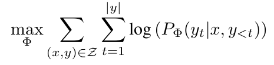
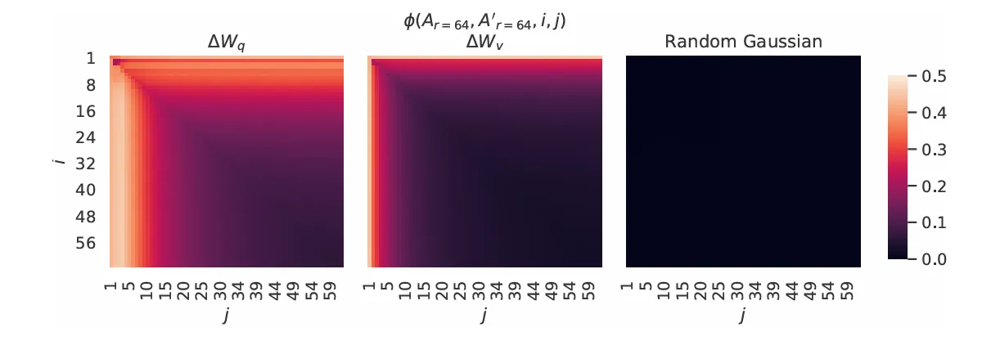

# LoRA: Low-Rank Adaptation of Large Language Models

[LoRA: Low-Rank Adaptation of Large Language Models | OpenReview](https://openreview.net/forum?id=nZeVKeeFYf9)

# 1. Problem statement

我們希望找到一組新的模型參數 Φ，使得當給定訓練數據中的輸入 x 時，模型能夠以最高的機率逐步預測出正確的目標輸出 y 中的每一個詞元。這是一個典型的自回歸語言模型的訓練目標。

而LoRA此篇文章提出更有效率的方法:

$\Phi_0$ 為預訓練模型參數，**$\Theta$** 代表一個比 $\Delta\Phi$ 小得多的參數集 $(|\Theta| \ll |\Delta\Phi|)$

也就是不直接訓練所有可能的 $\Delta\Phi$ ，而是去學習一組更小的參數 $\Theta$ ，然後用 $\Theta$ 來定義我們實際會用到模型上的 $\Delta\Phi$。

# 2. Method

## 理論基礎 : Low rank hypothesis - 低秩假設

低秩假設認為我們觀察到的模型可能會有較高的維度，但其內在的複雜度可能要低得多，這些潛在的關係可以用低秩的矩陣或張量來有效的表示或近似。

**深度學習模型壓縮：** 在深度神經網路中，權重矩陣可能非常龐大。低秩假設認為這些權重矩陣可能近似低秩，因此可以使用低秩分解（將一個大矩陣分解為兩個或多個小矩陣的乘積）來壓縮模型，減少參數數量，同時盡可能保持模型的性能。LoRA 中關於權重更新的低秩假設也屬於這個範疇。

### 內在維度

[Intrinsic Dimensionality Explains the Effectiveness of Language Model Fine-Tuning](https://arxiv.org/pdf/2012.13255)

此篇文章研究了一個關鍵問題 : 為什麼大預訓練語言模型如BERT, RoBERTa，微調下游任務時只需要少量特定任務數據即有很好的效果 ?

論文提出假設並證明 : 大模型要適應到下游特定任務，其需調整的參數的內在維度其實很低，也就是說整體參數屬於高維度，但要進行微調時，真正需要優化的參數量其實很少。

## 方法概述

受內在維度啟發，假設權重在適應過程中也具有較低的內在維度，也就是隨機投影到一個較小的子空間也能有效訓練。

對於一個預訓練權重 $W_0\in\mathbb{R}^{d*k}$，透過一個低秩分解表示權重更新來約束他。

$$
W_0+W = W_0 + BA
$$

其中 $B\in\mathbb{R}^{d*r}$， $A\in\mathbb{R}^{r*k}$，並且 $r\ll min(d, k)$

訓練過程中， $W_0$ 凍結不做梯度更新。對 A 做高斯初始化，B 為全 0。在訓練初期， $\Delta W = BA = 0$。

### 為什麼要 B*A

1. **實現 Low Rank :** 根據線性代數原理，一個 $d\times r$ 的 $B$ 與一個 $r\times k$ 的 $A$ 相乘是一個 $d \times k$ 的矩陣，但它的 rank 不會超過 $r$ 。
2. **提高參數效率 :** 訓練完整 $d\times k$ 維的 $\Delta W$ 需要訓練 $d\times k$ 個參數，將BA分開學習只需要 $r(d+k)$ 個參數。
3. **直觀理解 :** 這樣就是一個先壓縮再擴展的過程，先將高維輸入做特徵提取投影到 $r$ 維的空間，再升維回到原始的高維輸入空間。

# 3. 如何應用LoRA

## 3-1. 應用在哪個權重矩陣

一般來說這種技術可以應用到任何一部分的權重矩陣，此篇文章有研究在哪些 Layer 應用能達到最好的效果，也就是訓練的參數最少但有一定的效果。

作者發現，**單獨調整 Query (Wq) 和 Value (Wv) 權重通常就能獲得相當不錯的性能**，甚至在某些任務上接近調整所有注意力權重的性能。凸顯出這兩個權重矩陣對於適應下游任務可能更為重要。

注意力架構中會有四個權重矩陣 $W_q, W_k, W_v, W_o$ 以及 MLP 層，而在 MLP 做微調的效果有限，**可能是因為預訓練的 MLP 層已經具備了較好的特徵轉換能力，而注意力機制更需要針對特定任務進行調整以捕捉相關性。**

同樣參數下對 WikiSQL (自然語言生成結構化SQL查詢) , MultiNLI (判斷兩句子關係 : 支持、矛盾、中立) 資料集實驗

### 為什麼調整 Q, V 就可以達到很好效果

- Query是接收詞嵌入轉為查詢向量
- Key用於匹配查詢
- Value是最終注意力輸出的來源
- Output做線性轉換來計算最終注意力輸出。

所以微調Q可以讓模型學習更精準的查詢，微調V可以讓模型生成更適合特定下游的數值。

而K是用於匹配，可能預訓練就有學到足夠的表示，O負責整合多頭資訊，可能沒有比調整各個頭的關注點來得關鍵。

## 3-2. rank 的最佳設定

這個數據可以看到rank=1就可以有很好的效果，作者表示這可能應證了微調的內在秩非常低。後面又繼續加大 rank 不會覆蓋更有意義的子空間。

### 不同 r 值的LoRA模塊子空間相似性

上圖是作者分析 rank 採用 8 與 64 的low rank矩陣相似性。

這張圖可以看出在low rank兩個矩陣的相似性很高，這解釋了為什麼r=1也能有效微調。

### 不同隨機種子下的LoRA模塊子空間相似性

圖中展示了 LoRA 在 Transformer 模型的第 48 層中，對於 Query 權重和 Value 權重的low rank矩陣 A（r=64），當使用**兩個不同的隨機種子**進行初始化時，最終學習到的 A 矩陣的列向量之間的**歸一化子空間相似性**。

右圖是一個**對照組**。它顯示了兩個完全獨立生成的隨機高斯矩陣的列向量之間的歸一化子空間相似性。

### 更多實驗數據

此表格是做更多的rank實驗，大約在4-16最佳。