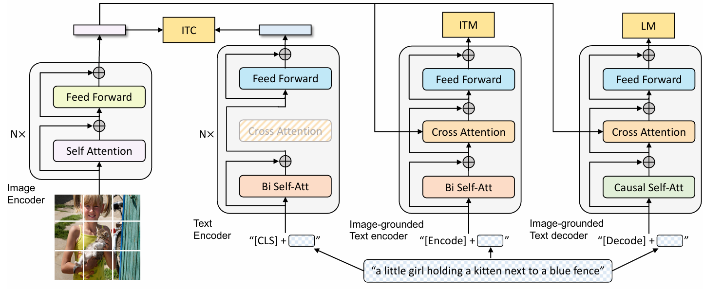

# Introduction

## 背景 :

近年來，視覺-語言預訓練（Vision-Language Pre-training, VLP）在多模態任務（如圖像-文本檢索、圖像描述生成、視覺問答等）中取得了顯著的進展。然而，現有的VLP模型通常只能在理解任務（如圖像-文本檢索）或生成任務（如圖像描述生成）中表現出色，很少有模型能夠同時在這兩類任務中都表現優異。此外，現有的方法主要依賴於從網絡上收集的大規模圖像-文本對進行預訓練，這些數據雖然規模龐大，但往往包含大量噪聲，影響了模型的性能。儘管通過擴大數據集規模可以帶來性能提升，但這些噪聲數據仍然不是最理想的監督來源。

## 目的 :

這篇論文的主要目的是提出一個新的VLP框架——BLIP（Bootstrapping Language-Image Pre-training），以解決現有方法的兩個主要限制：

1. **模型架構的限制**：現有的模型多是基於編碼器的模型（如CLIP），或是基於編碼器-解碼器的模型（如SimVLM），但這些模型在理解和生成任務之間的轉換並不靈活。BLIP旨在設計一個能夠同時處理理解和生成任務的統一模型架構。
2. **數據品質的限制**：現有的方法主要依賴於從網絡上收集的噪聲圖像-文本對進行預訓練，這些數據雖然規模大，但噪聲較多，影響了模型的性能。BLIP提出了一種新的數據增強方法（CapFilt），通過生成合成描述並過濾噪聲文本來有效利用這些噪聲數據。

## 結論 :

- **統一框架的成功**：BLIP通過Multimodal mixture of Encoder-Decoder (MED)模型，結合三個預訓練目標（圖文對比損失、圖文匹配損失和語言建模損失），實現了理解與生成任務的統一支持。
- **數據品質提升**：CapFilt方法通過生成多樣化的合成描述並過濾噪聲文本，顯著改善了噪聲網絡數據的質量。實驗表明，這種數據自舉策略在下游任務中帶來了顯著性能提升。
- **state-of-the-art性能**：BLIP在多種下游任務上取得了領先結果，例如：
    - 圖文檢索：在COCO數據集上平均recall@1提升了2.7%。
    - 圖像描述生成：在COCO數據集上CIDEr得分提升了2.8%。
    - 視覺問答：在VQA數據集上得分提升了1.6%。
- **零樣本遷移能力**：BLIP在視頻-語言任務（如文本到視頻檢索和視頻問答）上展示了強大的零樣本性能，甚至超越了一些專門針對視頻數據微調的模型。

# Architecture

BLIP 也就是 Bootstrapping Language-Image Pre-training ，這裡的Bootstraping指的是利用Captioner-Filter 機制來生成文本標註: Captioner 生成標註，Filter去除標註中的噪聲，從而得到更準確的標註。

## MED架構

MED(Multimodal micture of Encoder-Decoder)包含兩個單模態編碼器，一個以圖像為基礎的文本Encoder，和一個以圖像為基礎的文本Decoder :

1. Image Encoder : 採用ViT架構，將輸入圖像分割成多個patch並轉換成Image Embedding，使用CLS token來總結圖像的全局特徵。Image encode用來提取圖像特徵做對比學習，相當於CLIP中的Image encoder。
2. Text Encoder : 基於BERT的架構，將CLS token加到開頭做為句子的總結。Text encode用來提取文字特徵做對比學習，相當於CLIP的Text encoder。
3. Image-grounded Text Encoder : 在文本編碼器的自注意力（self-attention）層和前饋網路（feed-forward network）之間，添加一個交叉注意力（cross-attention, CA）層，用來注入視覺資訊。此外，還將 [Encode] 標記添加到輸入文本的開頭，以標識特定任務。圖像接地文本編碼器（Image-grounded text encoder）用於提取文本特徵，並將其與圖像特徵對齊，相當於 CLIP 中更精細化的文本-圖像對齊。
4. Image-grounded Text Decoder : 將圖像基礎文本編碼器的自注意力（self-attention）層替換為因果自注意力（causal self-attention）層，並將 [Decode] 標記和 [EOS] 標記添加到輸入文本的開頭和結尾，以標識序列的開始和結束。圖像基礎文本解碼器（Image-grounded text decoder）用於生成符合圖像和文本特徵的文本描述，這是 CLIP 中所沒有的。

<aside>

>💡
>Causal Self-Attention 是自注意力機制的一種重要變體，通過引入Mask機制確保生成任務的因果性，避免模型「偷看」未來的內容。

</aside>

架構圖，其中有同樣顏色的表示共用參數。

## 預訓練流程

- 圖文對比損失 ( Image-Text Contrastive Loss, ITC ) :
    
    ITC 用於訓練 Image Encoder 和 Text Encoder，透過對比學習對齊圖像和文本的特徵空間。具體方法是最大化正樣本圖像-文本對的相似度，並最小化負樣本圖像-文本對的相似度。這裡還使用了 ALBEF 中的動量編碼器（momentum encoder），目的是產生一些偽標籤，以輔助模型的訓練。
    
- 圖文匹配損失 ( Image-Text Matching Loss, ITM ) :
    
    ITM 用於訓練 Image-grounded text encoder，透過學習圖像-文本對的聯合特徵，實現視覺和語言之間的細粒度對齊。具體方法是透過一個二元分類任務，預測圖像文本對是正樣本還是負樣本。這裡還使用了 ALBEF 中的 hard negative mining 技術，以更好地捕捉負樣本資訊。
    

<aside>

>💡
>Hard Negative Mining 是 ALBEF 中的一項關鍵技術，通過選擇與正樣本相似但不匹配的困難負樣本，強迫模型學習更細節的特徵區分能力。

</aside>

- 語言建模損失 ( Language Modeling Loss, LM ) :
    
    LM 用於訓練 Image-grounded text decoder，實現生成圖像的文本描述任務。具體方法是透過優化交叉熵損失函數，訓練模型以自迴歸的方式最大化文本的概率。這裡還使用了 0.1 的標籤平滑（label smoothing）計算損失。
    

## CapFilt機制

CLIP, BLIP都是採用網路上大量的圖像文本對來訓練，這些網路資料品質不一，難以提供模型一個準確的目標來學習，於是提出了Captioning and Filtering機制來做改善。

- Captioner : Captioner 是基於 **Image-grounded Text Decoder（圖像引導的文本解碼器）** 打造的工具，專門用來“看圖說話”。它的任務是給一張圖片生成一段文字描述。
    - **輸入**：給它一張網絡圖片 $I_w$（比如從網上爬來的圖）。
    - **輸出**：Captioner 生成一個合成描述 $T_S$（synthetic caption），比如“Two birds are flying in the sky”
- Filter : Filter 是基於 **Image-grounded Text Encoder（圖像引導的文本編碼器）** 打造的“清潔工”，專門用來剔除不匹配的文本，把數據打掃乾淨。
    - **輸入**：
        - 原始網絡文本 $T_w$（比如網頁上的 alt-text）。
        - Captioner 生成的合成文本 $T_s$（剛剛生成的描述）。
        - 對應的圖片 $I_w$。
    - **過程**：
        - Filter 用圖像引導的文本編碼器，把圖片和文本融合成一個多模態表示。
        - 用 ITM 的頭部（head，一個線性層）預測這對圖文是否匹配。
        - 如果預測為“不匹配”（unmatched），就認為這個文本是噪聲，扔掉。

### 範例

假設有一張圖片 $I_w$ 是 “兩隻鳥在天上飛”：

- **原始網絡文本**  $T_w$：“免費下載圖片” → 明顯不相關。
- **Captioner 生成**  $T_s$：“Two birds are flying” → 很貼切。
- **Filter 的判斷**：
    - $T_w$：“免費下載壁紙” → ITM 說“不匹配”，扔掉。
    - **** $T_s$：“Two birds are flying” → ITM 說“匹配”，留下。

最後留下來的 **** $T_s$ 用來訓練模型，讓它學到更好的圖文對應。

# Result

---

BLIP 提出了全新的視覺語言框架，統一了視覺語言理解和生成，解決了處理不同任務的侷限性。

並且透過 Captioner 生成高品質的合成資料，Filtering 清洗數據，提高 Pretrained-model 的性能。

# Reference

---

https://blog.csdn.net/lansebingxuan/article/details/131594387

https://blog.csdn.net/m0_51976564/article/details/134356373