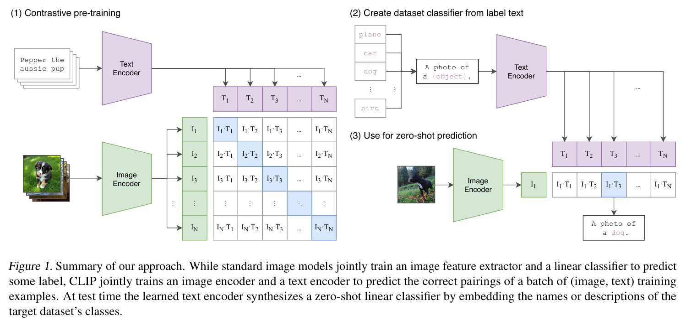

# Introduction

### 主要貢獻

- 提出使用**自然語言**監督訓練視覺模型的方法。
- 通過圖像-文本對的大規模數據集實現 Zero-shot classication。
- 在多個視覺任務上表現與完全監督模型相當，無需特定任務訓練數據。

### 背景介紹

OpenAI 的 CLIP（Contrastive Language-Image Pre-Training）論文介紹了一種創新方法，通過利用圖像和文本對的自然語言監督來訓練視覺模型。這意味著模型可以從圖像的文字描述中學習，而不僅僅依賴傳統的標籤分類。

### 訓練過程

CLIP 使用了 4 億對圖像-文本數據進行預訓練，這些數據從網路收集。這一規模巨大的數據集使其能夠學習廣泛的視覺概念。模型包括圖像編碼器和文本編碼器，兩者通過**對比損失函數**訓練，使圖像-文本對在嵌入空間中更接近。

### 零樣本分類能力

CLIP 能夠進行零樣本分類，這意味著它可以基於文本描述分類圖像，即使從未見過這些特定類別。例如，它可以達到 ImageNet 的 ResNet-50 準確度，卻無需使用任何 ImageNet 的 128 萬訓練示例。

### 性能與應用

該模型在超過 30 個不同的計算機視覺數據集上進行了基準測試，涵蓋 OCR、影片動作識別、地理定位和細粒度對象分類等多個任務。結果顯示，它在許多任務上與完全監督基線競爭，無需特定數據集訓練。

# Model Architecture

CLIP 包含兩個主要編碼器：

- **圖像編碼器**（Image Encoder）：
    - 可選架構：
        - **ResNet 變體**：如 ResNet-50、ResNet-101 及更高計算量的 RN50x4、RN50x16、RN50x64（Page 48, Table 19）。
            - 修改包括 ResNet-D 改進、抗鋸齒模糊池化（ antialiased rect-2 blur pooling）、注意力池化替代全局平均池化（Page 4）。
        - **Vision Transformer (ViT)**：如 ViT-B/32、ViT-B/16、ViT-L/14（Page 48, Table 20）。
    - 功能：將圖像轉換為固定維度的嵌入向量。
- **文本編碼器**（Text Encoder）：
    - 架構：基於 Transformer 的模型，參數包括層數（12）、寬度（512-1024）、注意力頭數（8-16）（Page 48, Tables 19-20）。
    - 功能：將文本轉換為嵌入向量，與圖像嵌入共享空間。
- **嵌入空間**：通過線性投影將圖像和文本嵌入映射到統一的多模態空間（Page 4）。
    
    
    

### Pseudocode

```jsx
# I[n, h, w, c]: 圖像批量
# T[n, l]: 文本批量
# W_i, W_t: 圖像和文本的投影權重
image_features = image_encoder(I)  # 提取圖像特徵
text_features = text_encoder(T)    # 提取文本特徵
image_embeddings = W_i @ image_features  # 投影到嵌入空間
text_embeddings = W_t @ text_features    # 投影到嵌入空間
logits = image_embeddings @ text_embeddings.T * exp(tau)  # 計算相似度
labels = arange(n)  # 真實對標籤
loss_i = cross_entropy(logits, labels, axis=0)  # 圖像視角損失
loss_t = cross_entropy(logits, labels, axis=1)  # 文本視角損失
loss = (loss_i + loss_t) / 2  # 對稱損失
```

### Evaluation

- **Zero-shot Transfer**：在 30 多個數據集上測試，包括 OCR、動作識別、地理定位及細粒度分類（Page 1）。
- **線性探針（Linear Probe）**：在 27 個數據集上訓練線性分類器，評估特徵質量（Page 38）。
- **性能**：
    - • ImageNet 零樣本準確率：76.2%（匹配 ResNet-50）（Page 6, Table 1）。
    - • 在 21/27 數據集上達到 SOTA（Page 38）。

# Result

OpenAI 的 CLIP 技術在後續的多模態發展中被廣泛應用，主要用於以下幾個方面：

### 1. **文本與圖像匹配（Text-Image Matching）**

CLIP 能夠理解圖像與文字之間的關係，因此被應用於搜尋與推薦系統。例如，使用者可以輸入描述性的文字，系統就能找到最匹配的圖片，或是用圖片來搜尋相關的文字描述。

### 2. **生成式 AI（Generative AI）**

CLIP 被用來提升 DALL·E 等圖像生成模型的性能，確保生成的圖片更符合文字描述。例如，DALL·E 透過 CLIP 來評估生成圖像的質量，使其更符合用戶輸入的文本指令。

### 3. **自動標註與內容理解（Image Captioning & Understanding）**

CLIP 能夠對圖片內容進行標籤化，甚至自動生成描述，這對於無障礙技術、社交媒體內容分析、以及 AI 助理的圖像理解能力提升很有幫助。

### 4. **多模態問答系統（Multimodal Question Answering）**

CLIP 被整合到 AI 助理中，使其能夠回答與圖像相關的問題。例如，當用戶上傳一張圖片並詢問「這是什麼品牌的鞋？」AI 可以根據圖片內容提供合理的回答。

# Reference

[https://u9534056.medium.com/用-10-分鐘搭建萬物識別的-live-demo-a80edcf0effb](https://u9534056.medium.com/%E7%94%A8-10-%E5%88%86%E9%90%98%E6%90%AD%E5%BB%BA%E8%90%AC%E7%89%A9%E8%AD%98%E5%88%A5%E7%9A%84-live-demo-a80edcf0effb)