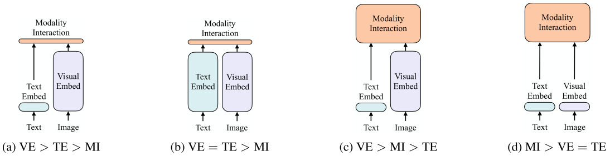

# Introduction

## 背景

近年來，視覺與語言預訓練（Vision-and-Language Pre-training, VLP）模型在多模態學習領域取得顯著進展。這些模型通常依賴於影像特徵提取技術，如區域監督（region supervision）和卷積神經網路，來嵌入視覺資訊。然而，這些方法存在兩大問題：

1. **計算效率**：提取影像特徵所需的計算量往往超過多模態交互的計算成本，降低模型運行速度。
2. **表達能力限制**：視覺嵌入器的表達能力受到其預定義的視覺詞彙影響，限制了模型的適應性。

## 目的

本研究提出**ViLT（Vision-and-Language Transformer）**，一種極簡的VLP模型，旨在透過以下方式提升效率：

- 移除深層視覺嵌入器（如CNN），改用**線性投影（linear projection）**來處理影像輸入，使視覺與文本的處理方式一致。
- 減少模型參數量與計算成本，使ViLT比傳統VLP模型**快數十倍**，同時在多模態下游任務（如視覺問答、圖文檢索等）達到競爭性的表現。

## **結論**

ViLT成功證明，在**不依賴區域特徵（如物件檢測）與卷積網路**的情況下，仍能在多模態任務中取得與現有方法相當甚至更好的效果。其主要優勢包括：

- **更快的推理速度**：與現有VLP模型相比，運行時間顯著縮短。
- **更小的計算需求**：減少視覺處理的開銷，使模型更加輕量化。
- **有效的多模態學習**：透過簡化視覺嵌入過程，將計算資源集中在變換器（Transformer）的多模態交互，提高模型整體效能。

# Architecture

### **VLM的分類 Taxonomy of Vision-and-Language Models**

上圖為四種不同類型的視覺與語言模型示意圖。其中每個矩形的高度代表相對的計算量大小，VE、TE 和 MI 分別是視覺嵌入、文本嵌入和模態交互的縮寫。

這種分類是依據 : 

1. 參數量或計算量上兩種模態是否平衡
2. 網路深層兩種模態是否交互作用

VSE、VSE++ 和 SCAN 屬於 (a) 類型。對圖像和文本獨立使用編碼器，圖像的較重，文本的較輕，使用簡單的點積或者淺層注意力層來表示兩種模態特徵的相似性。

CLIP 屬於 (b) 類型。每個模態單獨使用重的 Transformer 編碼器，使用池化後的圖像特徵點積計算特徵相似性。

ViLBERT、UNTER 和 Pixel-BERT 屬於 (c) 類型。這些方法使用深層 Transformer 進行交互作用，但是由於 VE 仍然使用重的卷積網路進行特徵抽取，導致計算量依然很大。

作者提出的 ViLT 屬於 (d) 類型。ViLT 是首個將 VE 設計得與 TE 一樣輕量的方法，該方法的主要計算量都集中在模態交互上。

### **模態交互方式 Modality Interaction Schema**

### **Single-Stream：同樣的 Encoder 空間**

- 在 **Single-Stream** 方法中（如 ViLT、UNITER、VisualBERT），圖像和文本的特徵會被**拼接（concatenate）**到同一個序列中，然後送入 **單一 Transformer** 進行處理。
- **Transformer 的自注意力機制**（Self-Attention）本身能夠學習不同模態之間的關聯，讓文本和圖像特徵在相同的隱空間（latent space）中交互。
- **這樣的設計避免了額外的跨模態計算成本**，因為模態間的資訊流動發生在相同的計算框架內。

### **Dual-Stream：額外的跨模態交叉注意力**

- 在 **Dual-Stream（雙流）** 方法中（如 ViLBERT、LXMERT），圖像和文本分別進入**各自的 Transformer 編碼器**，然後在**交叉注意力（Cross-Attention）**層中進行跨模態資訊融合。
- **這樣的設計可以保留每個模態的獨立性**，讓圖像和文本在初始階段分別學習自己的特徵，之後再進行跨模態對齊。
- **缺點是增加了額外的計算開銷**，因為需要額外的 Transformer 來處理跨模態交互。

ViLT 沿用了單流的交互方式，因為雙流會引入額外的計算量。

### **圖像嵌入架構 Visual Embedding Schema**

現有的 VLP 模型的文本嵌入（text embedding）基本上都使用類 BERT 結構，但是視覺嵌入存在著差異。在大多數情況下，視覺嵌入是現有 VLP 模型的瓶頸。視覺嵌入的方法總共有三大類，其中區域特徵（region feature）方法通常採用 Faster R-CNN 二階段檢測器提取區域的特徵，網格特徵（grid feature）方法直接使用 CNN 提取網格的特徵，圖塊投影（patch projection）方法將輸入圖片切片投影提取特徵。ViLT 是首個使用圖塊投影來做視覺嵌入的方法。

Patch Projection 是 **一種視覺特徵提取方法**，其主要步驟為：

1. **將輸入圖片切割成固定大小的 Patch（如 16×16 或 32×32）**，類似於 CNN 進行卷積操作時的「視覺感受野」。
2. **對每個 Patch 進行線性投影（Linear Projection）**，將其轉換為與 Transformer 可處理的向量表示（embedding）。
3. **加上位置編碼（Positional Embedding）**，以保留影像的空間資訊。
4. **輸入 Transformer 進行處理**，讓自注意力（Self-Attention）學習 Patch 之間的關聯性。

這種方法的特點：

- 不需要 CNN 來提取特徵。
- 直接將圖片當作類似文本的序列輸入 Transformer。
- **是 ViT 採用的視覺嵌入技術**。

### Vision and Language Transformer

作者提出的方法算是當時最簡單的多模態Transformer方法，ViLT使用預訓練的ViT來初始化交互的transformer，這樣就可以直接處理視覺特徵，不需要額外接圖像encoder。

文本特徵輸入部分，將文本看成一個詞序列，透過詞嵌入矩陣（word embedding matrix）轉換成詞嵌入（word embedding），然後和位置嵌入（position embedding）進行相加，最後和模態類型嵌入（modal-type embedding）進行串接（concate）。

圖像特徵輸入部分，將圖像切塊看成一個圖像塊序列，透過線性投影轉換成視覺嵌入，然後和位置嵌入進行相加，最後和模態類型嵌入進行串接。

其中詞嵌入（word embedding）和視覺嵌入（visual embedding）透過可學習的模態類型嵌入（modal-type embedding）標誌位來區分，其中 0 標誌位表示詞嵌入部分，1 標誌位表示視覺嵌入部分。

詞嵌入（word embedding）和視覺嵌入（visual embedding）分別都嵌入了一個額外的可學習 [class] 嵌入，方便和下游任務對接。

### 預訓練目標

- 圖像文本匹配（Image Text Matching, ITM）。
- 遮蔽語言建模（Masked Language Modeling, MLM）。

圖像文本匹配：隨機以 0.5 的機率將文本對應的圖片替換成不同的圖片，然後對文本標誌位對應輸出使用一個線性的 ITM head 將輸出特徵映射成一個二元 logits，用來判斷圖像文本是否匹配。另外 ViLT 還設計了一個詞塊對齊（word patch alignment, WPA）來計算文本子集和視覺子集的對齊分數。

遮蔽語言建模：MLM 的目標是透過文本的上下文資訊去預測遮蔽（masked）的文本 tokens。隨機以 0.15 的機率遮蔽 tokens，然後文本輸出接兩層 MLP 與遮蔽的 tokens。

全詞遮蔽：另外 ViLT 還使用了全詞遮蔽（whole word masking）技巧。全詞遮蔽是將連續的子詞 tokens 進行遮蔽的技巧，避免了只透過單詞上下文進行預測。比如將 “giraffe” 詞 tokenized 成 3 個部分 ["gi", "##raf", "##fe"]，可以遮蔽成 ["gi", "[MASK]", "##fe"]，模型會透過遮蔽的上下文資訊 [“gi”，“##fe”] 來預測遮蔽的 “##raf”，這樣會導致不利用圖像資訊。

# Result

圖中可看出模型有學到對應關係

# Reference

https://blog.csdn.net/weixin_44031582/article/details/120660797